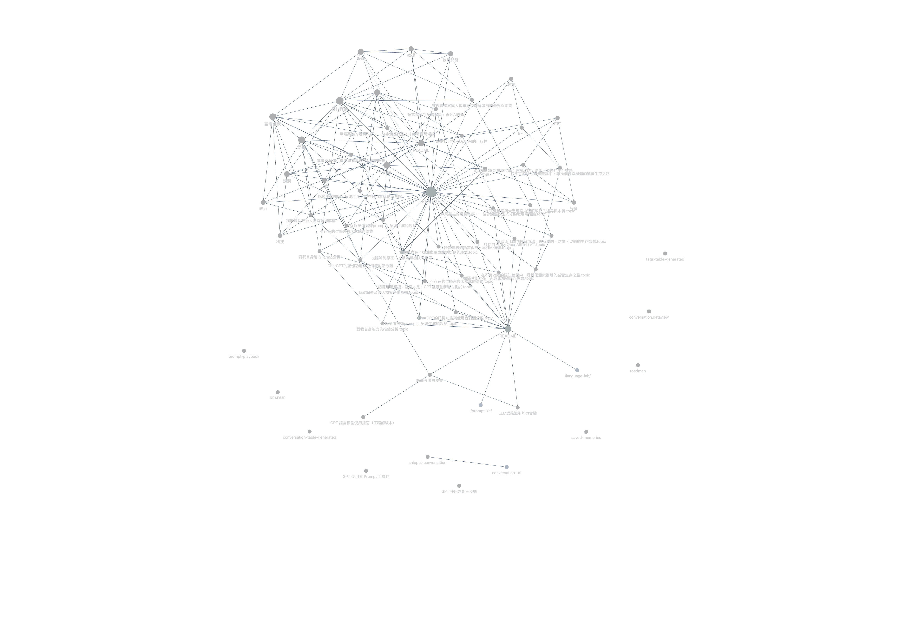

# 🧾 Obsidian 資料視圖（Dataview）說明

本資料夾紀錄了我在 Obsidian 中使用 Dataview plugin 所撰寫的腳本與其對應的輸出結果，主要目的是讓 conversation 與 tags 兩個語場維度能被快速索引、視覺化與交叉檢閱。

## 📁 資料結構說明

- `dataview/`：放置 JavaScript 格式的 Dataview 腳本，可透過 Obsidian 的 DataviewJS 執行。
  - `conversation-table.js`：將 `conversation/` 中的語場主題對話列為索引表
  - `tags-table.js`：將 `tags/` 中的主題標籤依主題類別整理成表格
- `conversation-table-generated.md`：執行上述 script 後產出的 conversation 主題表格
- `tags-table-generated.md`：執行 tags table script 後的主題索引可視化輸出

## 🧪 使用方式（於 Obsidian + Dataview plugin 環境中）

1. 將本資料夾內容放置於你的 Obsidian vault 中（建議與 `conversation/`、`tags/` 同層）
2. 確保 Dataview plugin 已啟用，並允許 DataviewJS 腳本執行
3. 開啟 `.js` 檔案內容，在 Obsidian 中複製至空白 `.md` 文件中的代碼塊使用：
   \`\`\`dataviewjs
   // 貼上對應腳本內容
   \`\`\`

## 💡 設計理念

這套 Dataview 腳本的出發點，其實很簡單：

> 在用 Obsidian 做大量筆記的人，很容易累積出一堆 tag、分類、主題，但不容易整理、對照或回頭快速瀏覽。  
> 我只是把我自己的對話記錄、標籤分類整理了一下，希望也能給其他人參考怎麼用 Dataview 來「生成你自己的索引頁」。

你不需要知道這些對話的背景，也不需要理解什麼是「語場」。
你只要想要在 Obsidian 裡看到一張 tag 表、一份主題對話表，這些腳本就能直接幫你做到。

如果你剛好也在想怎麼整理筆記，這些東西也許能幫上點忙。

## 🧭 Vault 結構圖（Graph View）

這是整體 conversation 與 tags 資料在 Obsidian 中的視覺結構圖，由內建 Graph View 功能產出，能幫助理解語場之間的連結與分布狀態。

